# Non-Technical Results Of War Events Data Analysis

We did a very detailed research trying to investigate the effect of conflicts on education and students' lives. Our domain research included different aspects of education, from the impact of AI on education to the effect of war on online learning.
At the end, we chose to study the effects of war on students' academic performance and activity.

## Problem statement

In regions affected by war, the education system is one of the first societal structures to collapse. Students who once demonstrated high academic performance and consistent attendance often experience a significant decline
in both after the conflict begins. Violence, displacement, psychological trauma, and the breakdown
of infrastructure such as internet access or school
availability
contribute to reduced academic outcomes and disrupted attendance.
This project investigates how armed conflict affects students' performance and attendance over time. By comparing pre-conflict and during-conflict academic records, we aim to understand the depth of disruption and identify patterns that can inform
targeted interventions. research question.

## Research Question

How does war disruption, such as violence, displacement, and infrastructure breakdown, impact students' academic performance and attendance in online learning for students in colleges in war-affected zones?

## How are we modeling our problem?

We are collecting data from the Islamic University of Gaza (IUG), this data includes Moodle logs capturing various student interactions in online learning during wartime, with fields such as:

Timestamp
Event type (e.g., view, submit, login, forum post)
Course ID
Module
Duration on page
Grade items
Cohort or department identifiers
Gender
Level of study (when linked via user profiles), we believe these features

We have also gathered war events data from online websites. We are planning to correlate these with students' performance.

As we still lack direct students' performance data in Gaza, we did a simple analysis of war events data. Through this analysis, we aim to measure the war's impact on the education system in Gaza. Until we get access to the students' performance data
We still believe that the simple analysis of war events data contributes strongly to answering our research question.

* The data we collected is structured in tabular form.

### Possible flaws

* Some of the war events data we collected online contains untrue or misleading values, like the number of fatalities in a lot of datasets is in fact, less than the actual number.

* We are going to be trying our best to take into consideration all of the harsh war events that college students in Gaza go through, but due to a lack of data availability online about war events, we might miss some important effects.

* Some of the war events data that we have is not really up to date with the situation, and does not report events after the formal comeback to studies in colleges.

### Data Analysis Displacements Orders

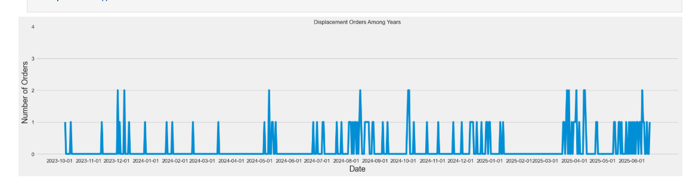

As we can see, there are some intensive months with many displacement orders, like:

* 12/2023
* 05/2024 - 02/2025
* end of 03/2025 - mid 05/2025
* 06/2025
* There are some less intensive months like: 02/2025, 03/2025, because there were temporary ceasefires.

Considering the fact that college students got back to formal studying in July 2024, this high number of displacement orders students have to go through during, after, and before active studying will for sure have an effect on their performance.

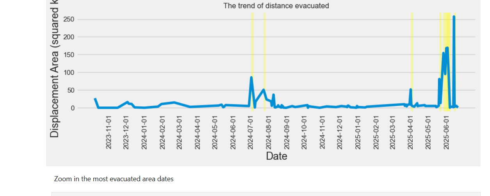

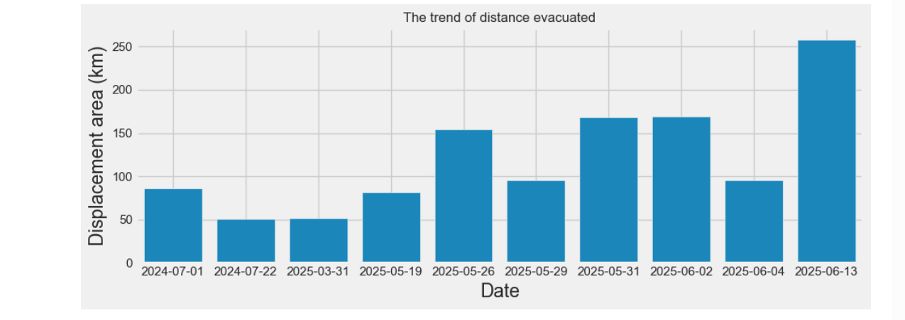

We can also see there are overlaps between dates and months. Regarding 2023, most of the displacement happened to the north, so not much of an area was evacuated in comparison to 2024 and 2025, when orders have caused evacuation to more and more areas
in the north and south as well.

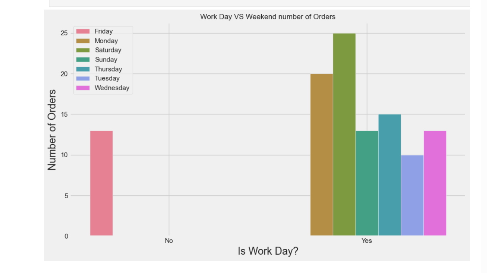

Key finding: As most orders were issued on work days (according to the Arabic calendar), this affects students' performance for sure, because the majority of exams, activities, and sessions will be issued from Saturday to Thursday (Friday is the weekend),
especially on IUG.

### Data Analysis casualties_data

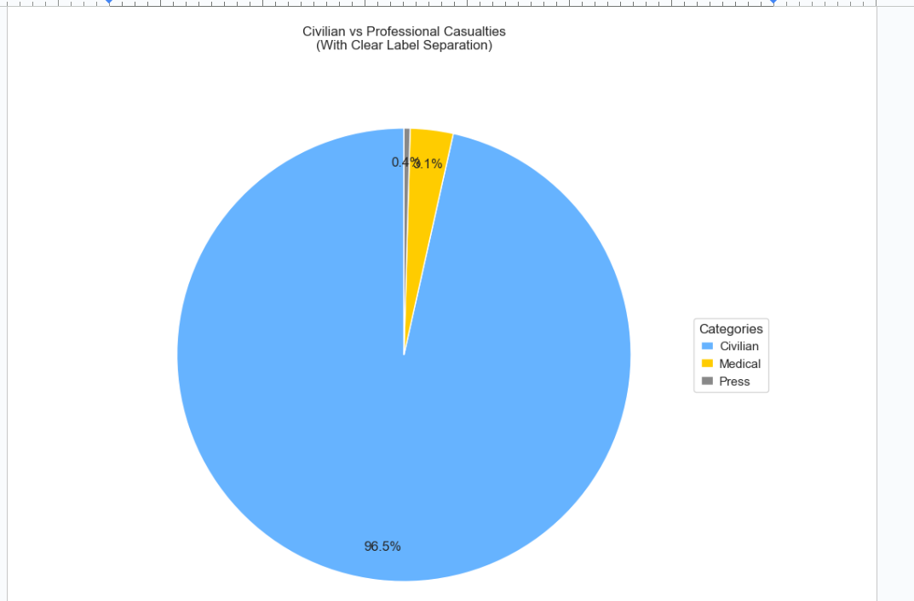
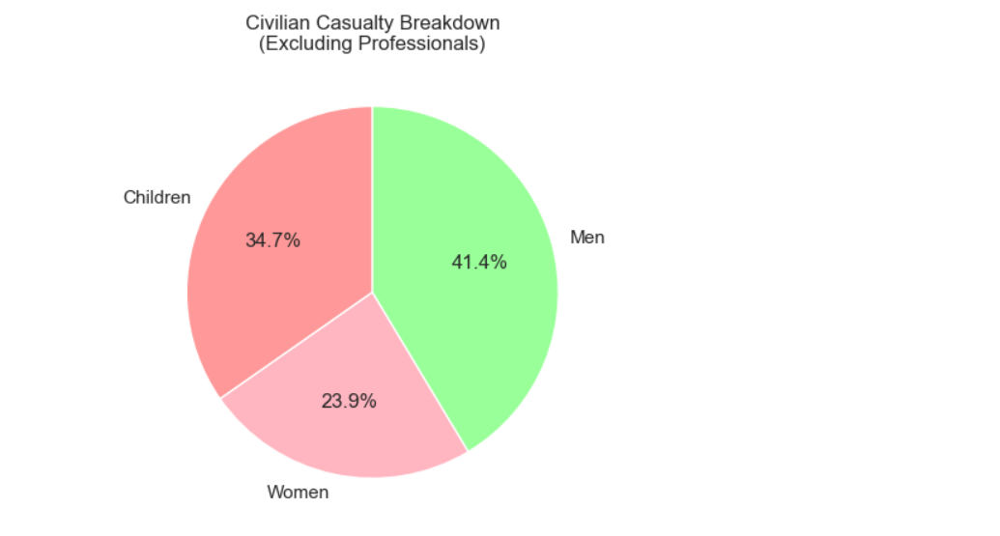

96.5% of the daily casualties are civilians, with 34.7% Children, 41.4% men, and 23.9% women.

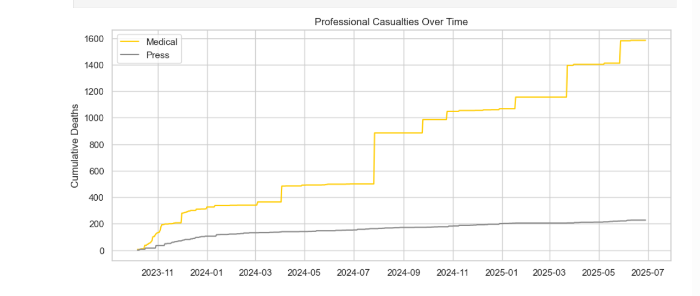

As we can see from the plot, professional deaths kept increasing over time. A lot of medical professionals were dying, which reflects the medical infrastructure, which in turn reflects that students in Gaza are not gonna get good medical care.
Medical Impact: 227 medical personnel deaths, mostly early in the conflict.

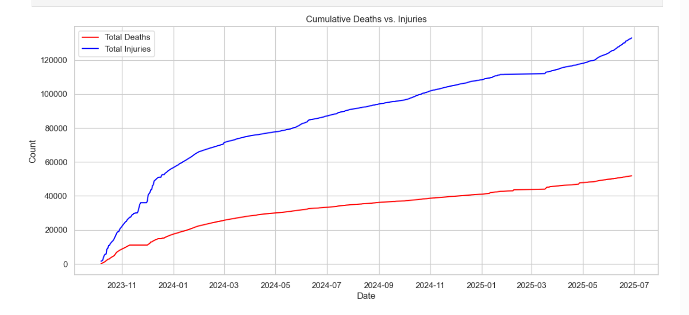

Long-term Trauma: Over 130,000 injuries indicate severe public health consequences.

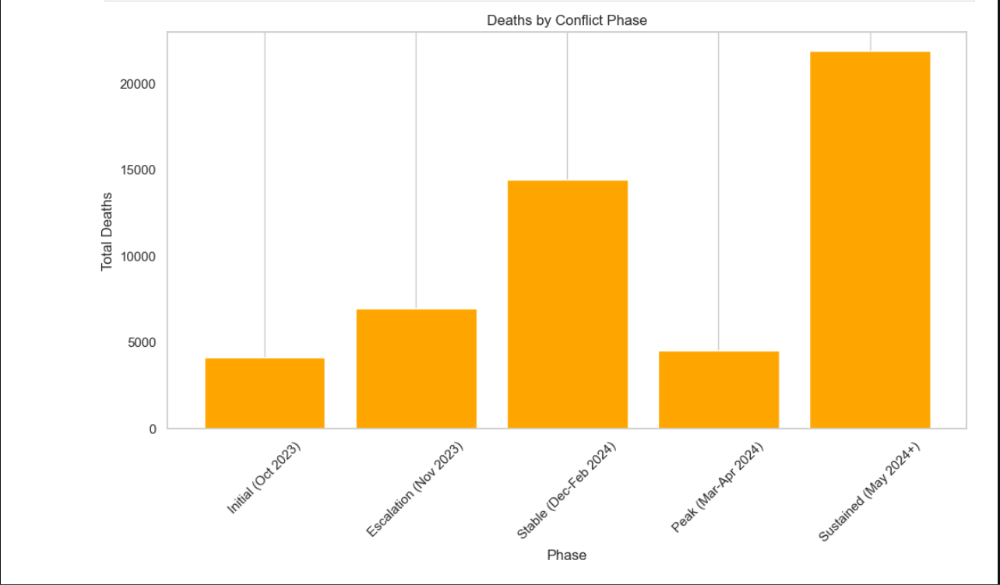

After the peak period, deaths remained high, most deaths happened in May 2024 onward, coinciding with students getting back to formal online college education.

### Data Analysis Infrastructure Damage

Average Impact on Education Facilities per Active Day
Destroyed: 1.61 buildings/day
Damaged: 3.13 buildings/day

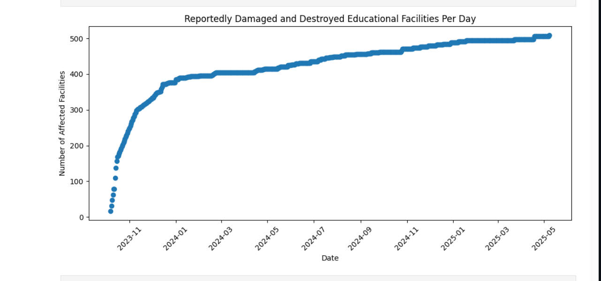

The number of  daily affected(damaged or destroyed) educational facilities kept increasing over time, this for sure includes schools and colleges.

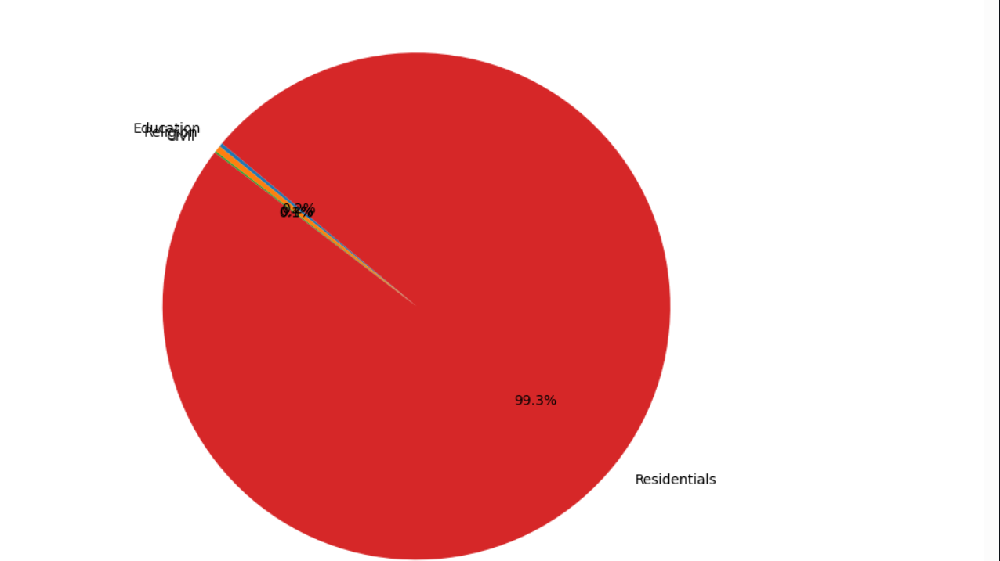
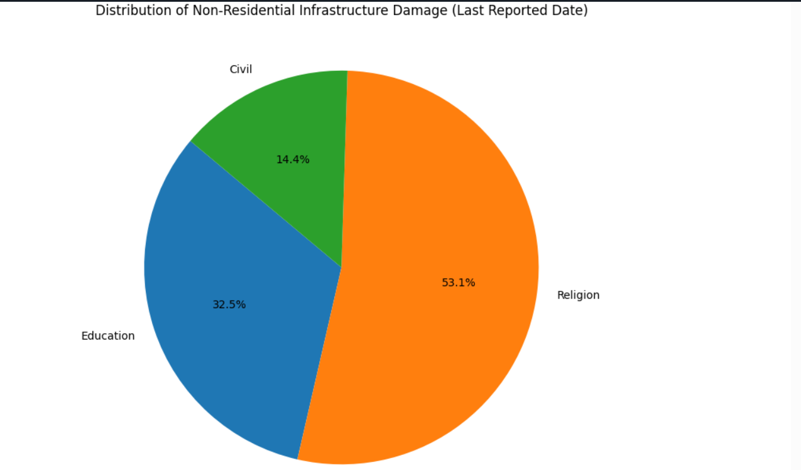

When not considering the residential infrastructure damage. 32.5% of the infrastructure damage that happened during the reported time is educational infrastructure damage, but for sure, we should not be ignoring that 99.3% of the damaged infrastructure
was residential, because to us, it means that a lot of the students' houses were destroyed.

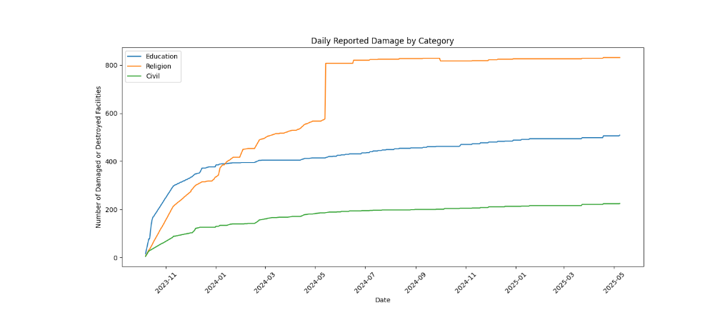

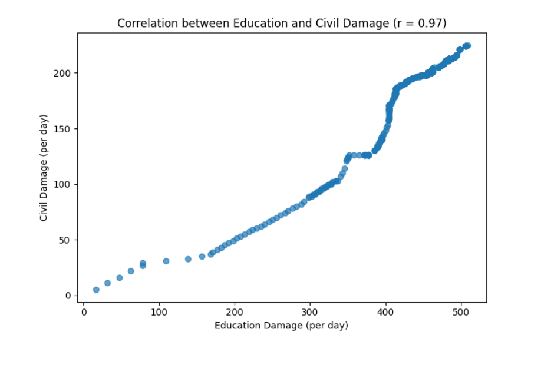
From the plot we can see that there is a high correlation between civil damage and educational infrastructure damage (positive association)

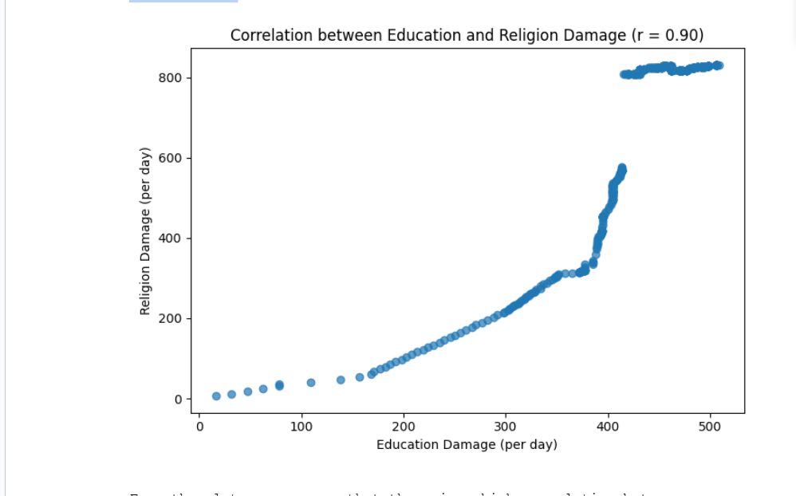
From the plot, we can see that there is a high correlation between the daily religion infrastructure damage and the daily educational infrastructure damage (positive association)

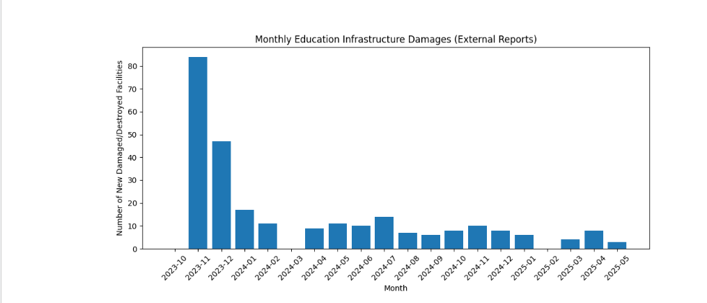
In the beginning months, a large number of educational infrastructures were damaged or destroyed. We can see that at the beginning of the war a lot of educational facilities were attacked.

### Data Analysis Food Insecurity

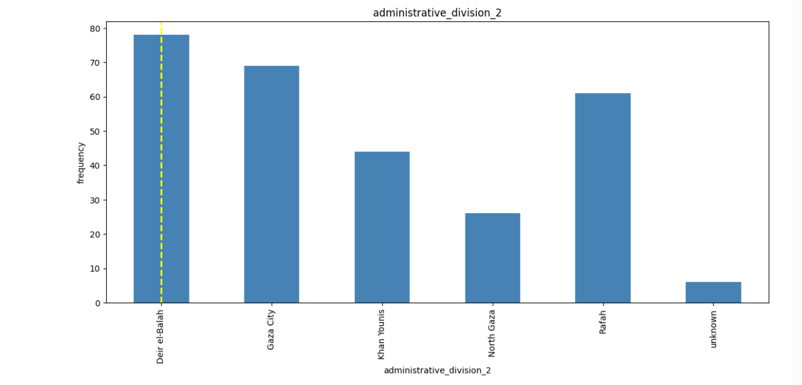

Deir el-Balah has the most food infrastructure attacks (more than 75) and from the plot we can see that Gaza city has more than 65 attacks coming directly after Deir el-Balah, both Deir el-Balah and Gaza city are in the central part of Gaza and they
are high populated cities (at least before the war).

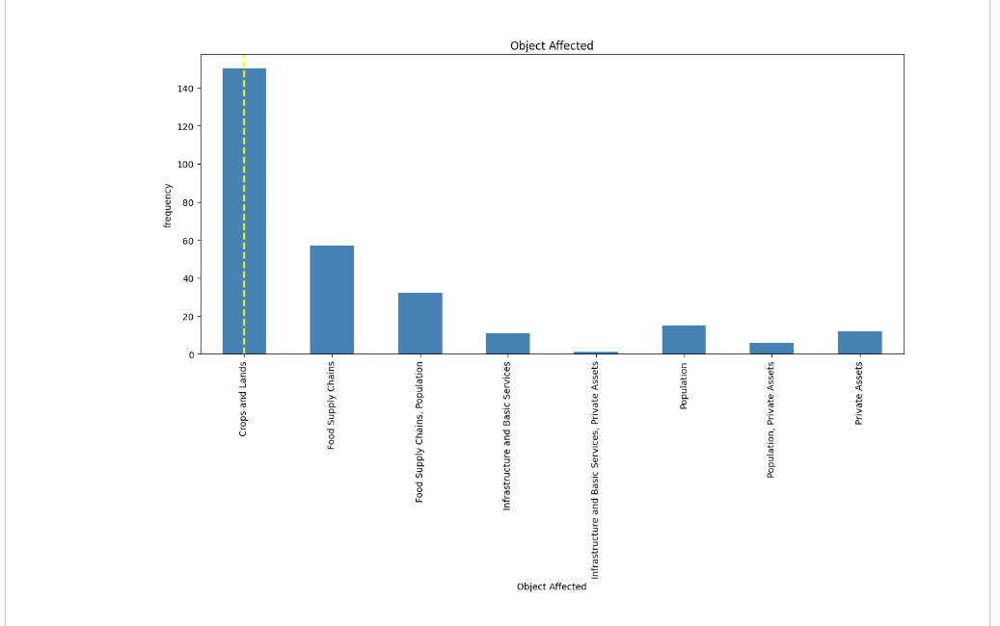
the most affected objects are 'crops and lands', then, 'food supply chains', and lastly comes 'food supply chains,populations'.

during the period (October 2023 to mid-September 2024)there were around 150 events that affected 'Agricultural Land'(crops and lands), as well as 24 events that affected market and 24 events affected bakeries (food supply chains) -
which reflects the food insecurity.

#### the period of July 2024 to september 2024

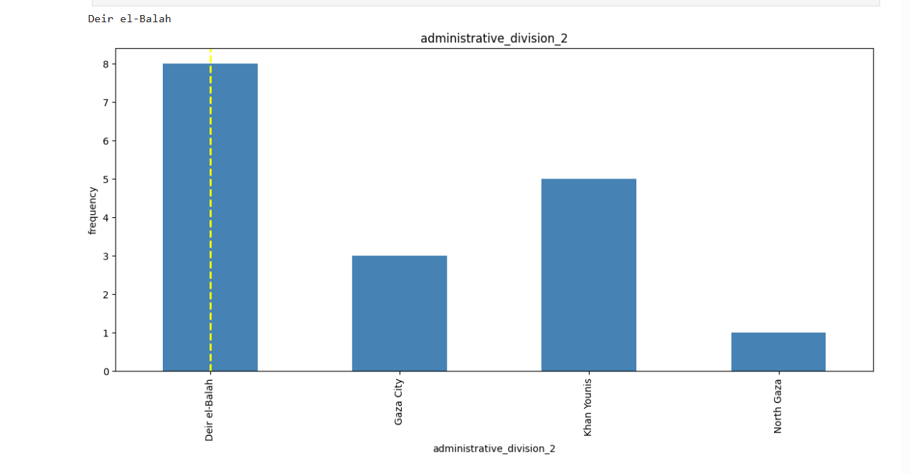

we can see that within this period of time, most of the food infrastructure affected is in Deir el-Balah and Khan Younis.

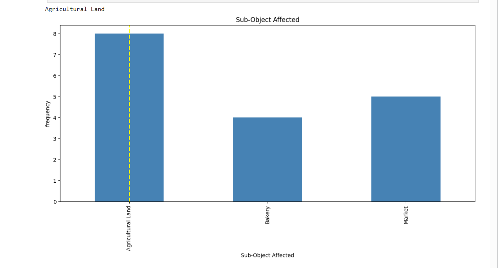

the most effected Sub-Object within the period of July to September 2024 is Agricultural Lands (8), then, markets (5), and lastly 4 events affected bakeries-also reflects food insecurity.
